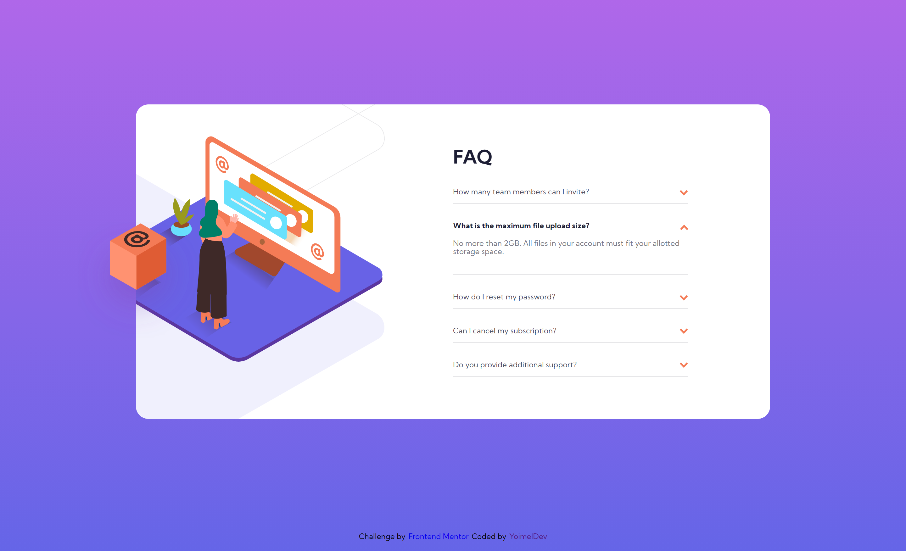
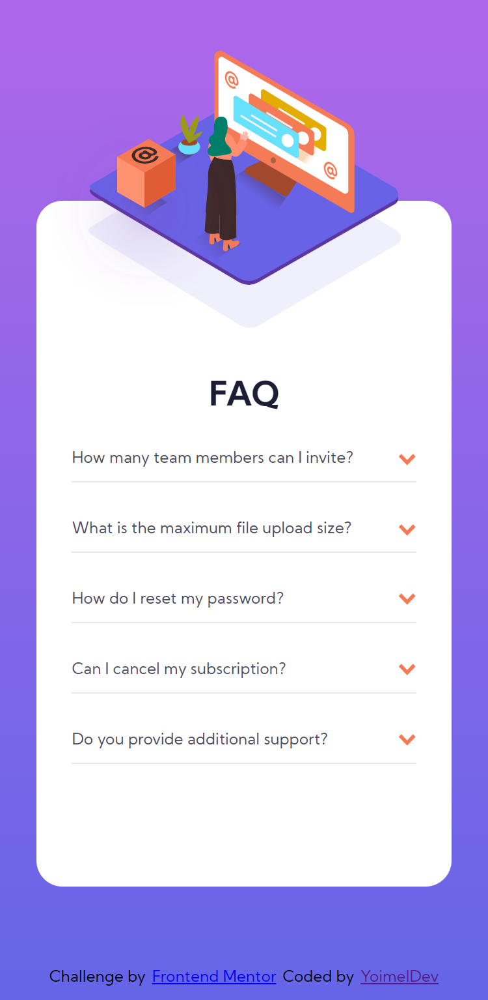

# Frontend Mentor - FAQ accordion card solution

## ✍🏻 Description

[FAQ accordion card challenge on Frontend Mentor](https://www.frontendmentor.io/challenges/faq-accordion-card-XlyjD0Oam), where i put into practice my skills, trying to make it as close as possible to the design provided.

## 🎨 Preview

You can see the result here → [FAQ accordion card](https://faq-accordion-card-yoimeldev.netlify.app/)

    
🖥️ Desktop version

    
📱 Mobile version

## :computer: Technologies

- Gulp
- Sass
- Js
- Mobile-first workflow
